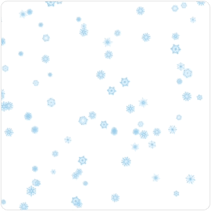

❄️ Falling snowflakes
==================
[](https://www.npmjs.com/package/magic-snowflakes)
[](https://www.npmjs.org/package/magic-snowflakes)
[](https://david-dm.org/hcodes/snowflakes)
[](https://travis-ci.org/hcodes/snowflakes)
[](https://bundlephobia.com/result?p=magic-snowflakes)





## Details
- Only one JavaScript file (8 KB, GZIP)
- CSS Animation
- Rubber design
- Flexible settings

## Examples
- [Demo](https://hcodes.github.io/demo-snowflakes/)
- [Simple](https://hcodes.github.io/snowflakes/examples/simple.html)
- [Big](https://hcodes.github.io/snowflakes/examples/big.html)
- [Increased speed](https://hcodes.github.io/snowflakes/examples/increased_speed.html)
- [Layer](https://hcodes.github.io/snowflakes/examples/layer.html)
- [Own color](https://hcodes.github.io/snowflakes/examples/color.html)
- [Own kind](https://hcodes.github.io/snowflakes/examples/balls.html)
- [Own z-index](https://hcodes.github.io/snowflakes/examples/z-index.html)
- [start() and stop()](https://hcodes.github.io/snowflakes/examples/start_stop.html)
- [Without wind](https://hcodes.github.io/snowflakes/examples/without_wind.html)

[See details](https://github.com/hcodes/snowflakes/tree/master/examples)

## Using

```
npm i magic-snowflakes --save-dev
```
or
```
yarn add magic-snowflakes
```

### Without settings
```html
<html>
<body>
    ...
    <script src="https://unpkg.com/magic-snowflakes/dist/snowflakes.min.js"></script>
    <script>
        Snowflakes();
    </script>
</body>
</html>
```

or

```js
'use strict';

const Snowflakes = require('magic-snowflakes');
Snowflakes();
```

### Advanced settings
```html
<html>
<body>
    <div id="snowflakes-container" style="width: 1000px; height: 500px;"></div>
    <script src="https://unpkg.com/magic-snowflakes/dist/snowflakes.min.js"></script>
    <script>
        var sf = new Snowflakes({
            color: '#f00', // Default: "#5ECDEF"
            container: document.querySelector('#snowflakes-container'), // Default: document.body
            count: 100, // 100 snowflakes. Default: 50
            minOpacity: 0.1, // From 0 to 1. Default: 0.6
            maxOpacity: 0.95, // From 0 to 1. Default: 1
            minSize: 20, // Default: 8
            maxSize: 50, // Default: 18
            rotation: true, // Default: true
            speed: 2, // The property affects the speed of falling. Default: 1
            wind: false, // Without wind. Default: true
            width: 500, // Default: width of container
            height: 250, // Default: height of container
            zIndex: 100 // Default: 9999
        });
    </script>
</body>
</html>
```

## Different Builds
In the `dist/` directory of [the NPM package](https://unpkg.com/magic-snowflakes/dist/) you will find many different builds of snowflakes.js.

|Type                   |Filename                 |Description       |
|-----------------------|-------------------------|------------------|
|Full (UMD)             |`snowflakes.js`          |                  |
|Full (UMD, production) |`snowflakes.min.js`      |                  |
|Light (UMD)            |`snowflakes.light.js`    |Without SVG images|
|Light (UMD, production)|`snowflakes.light.min.js`|Without SVG images|


## Development
```
git clone git@github.com:hcodes/snowflakes.git ./snowflakes
cd ./snowflakes

npm i
npm run build
npm test

open ./dev-examples/
```

## [License](LICENSE)
MIT License
